# Capsules Network

“A capsule is a group of neurons whose activity vector represents the instantiation parameters of a specific type of entity such as an object or object part. We use the length of the activity vector to represent the probability that the entity exists and its orientation to represent the instantiation parameters. Active capsules at one level make predictions, via transformation matrices, for the instantiation parameters of higher-level capsules. When multiple predictions agree, a higher level capsule becomes active. We show that a discriminatively trained, multi-layer capsule system achieves state-of-the-art performance on MNIST and is considerably better than a convolutional net at recognizing highly overlapping digits. To achieve these results we use an iterative routing-by-agreement mechanism: A lower-level capsule prefers to send its output to higher level capsules whose activity vectors have a big scalar product with the prediction coming from the lower-level capsule.”

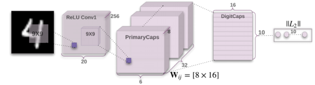


## Papers:
- [Dynamic Routing Between Capsules](https://arxiv.org/abs/1710.09829)
- [MATRIX CAPSULES WITH EM ROUTING](https://openreview.net/pdf?id=HJWLfGWRb) and [here](https://openreview.net/forum?id=HJWLfGWRb&noteId=HJWLfGWRb)

## References

### Reading Materials
- [https://blog.acolyer.org/2017/11/13/dynamic-routing-between-capsules/](https://blog.acolyer.org/2017/11/13/dynamic-routing-between-capsules/)
- [https://hackernoon.com/what-is-a-capsnet-or-capsule-network-2bfbe48769cc](https://hackernoon.com/what-is-a-capsnet-or-capsule-network-2bfbe48769cc)
- **[https://jhui.github.io/2017/11/03/Dynamic-Routing-Between-Capsules/](https://jhui.github.io/2017/11/03/Dynamic-Routing-Between-Capsules/)**
- https://jhui.github.io/2017/11/14/Matrix-Capsules-with-EM-routing-Capsule-Network/
- **[https://dasayan05.github.io/blog/jekyll/update/2017/11/20/an-intuitive-understanding-of-capsules.html](https://dasayan05.github.io/blog/jekyll/update/2017/11/20/an-intuitive-understanding-of-capsules.html)**
- https://becominghuman.ai/understand-and-apply-capsnet-on-traffic-sign-classification-a592e2d4a4ea

### References
- https://en.m.wikipedia.org/wiki/Graphics_pipeline
- https://hackernoon.com/supervised-deep-learning-in-image-classification-for-noobs-part-1-9f831b6d430d
- https://github.com/Kulbear/deep-learning-nano-foundation/wiki/ReLU-and-Softmax-Activation-Functions

### Videos
- https://youtu.be/rTawFwUvnLE
- https://www.youtube.com/watch?v=VKoLGnq15RM

### Code Bases
- [https://github.com/naturomics/CapsNet-Tensorflow](https://github.com/naturomics/CapsNet-Tensorflow)
- [https://github.com/naturomics/CapsLayer](https://github.com/naturomics/CapsLayer)
- https://www.kaggle.com/kmader/capsulenet-on-mnist
- https://github.com/debarko/CapsNet-Tensorflow
- https://github.com/gram-ai/capsule-networks
- https://github.com/nikhil-dce/Transforming-Autoencoder-TF
- https://github.com/XifengGuo/CapsNet-Keras
- https://github.com/llSourcell/capsule_networks
- https://github.com/deepblacksky/capsnet-tensorflow
------------------------------------------------------------------------------

# A touch on CNNs

CNN are essentially a system where we stack a lot of neurons together. These networks have been proven to be exceptionally great at handling image classification problems. It would be hard to have a neural network map out all the pixels of an image since it‘s computationally really expensive. So convolutional is a method which helps you simplify the computation to a great extent without losing the essence of the data. **Convolution is basically a lot of matrix multiplication and summation of those results.**


After an image is fed to the network, a set of kernels or filters scan it and perform the convolution operation. This leads to creation of feature maps inside the network. These features next pass via activation layer and pooling layers in succession and then based on the number of layers in the network this continues. 

**Activation layers** are required to induce a sense of **non linearity in the network** (eg: [ReLU](https://github.com/Kulbear/deep-learning-nano-foundation/wiki/ReLU-and-Softmax-Activation-Functions)). 

**Pooling** (eg: max pooling) helps in **reducing the training time**. The idea of pooling is that it creates “summaries” of each sub-region. It also gives you a little bit of positional and translational invariance in object detection. At the end of the network it will pass via a classifier like softmax classifier which will give us a class. Training happens based on back propagation of error matched against some labelled data. Non linearity also helps in solving the vanishing gradient in this step.

## What is the problem with CNNs?

CNNs perform exceptionally great when they are classifying images which are **very close to the data set**. If the images have **rotation**, **tilt** or any other different orientation then **CNNs have poor performance**. 

This problem was solved by adding different variations of the same image during training. In CNN each layer understands an image at a much more granular level. 

Lets understand this with an example. If you are trying to classify **ships** and **horses**. 

- The innermost layer or the 1st layer understands the small curves and edges. 
- The 2nd layer might understand the straight lines or the smaller shapes, like the mast of a ship or the curvature of the entire tail. 
- Higher up layers start understanding more complex shapes like the entire tail or the ship hull. 
- Final layers try to see a more holistic picture like the entire ship or the entire horse. We use pooling after each layer to make it compute in reasonable time frames. But in essence it also **loses out the positional data.**

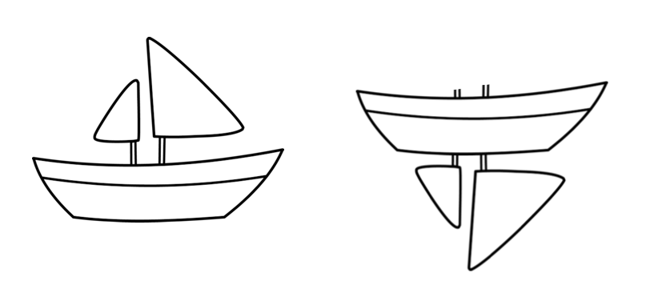


**Pooling helps in creating the positional invariance.** Otherwise CNNs would fit only for images or data which are very close to the training set. This invariance also leads to triggering false positive for images which have the components of a ship but not in the correct order. **So the system can trigger the right to match with the left in the above image.** You as an observer clearly see the difference. The pooling layer also adds this sort of invariance.

This was never the intention of pooling layer. What the pooling was supposed to do is to **introduce positional, orientational, proportional invariances.** But the method we use to get this uses is very crude. In reality it adds all sorts of positional invariance. Thus leading to the dilemma of detecting right ship in above picture as a correct ship. **What we needed was not invariance but equivariance.** Invariance makes a CNN tolerant to small changes in the viewpoint. Equivariance makes a CNN understand the rotation or proportion change and adapt itself accordingly so that the spatial positioning inside an image is not lost. A ship will still be a smaller ship but the CNN will reduce its size to detect that. This leads us to the recent advancement of Capsule Networks.

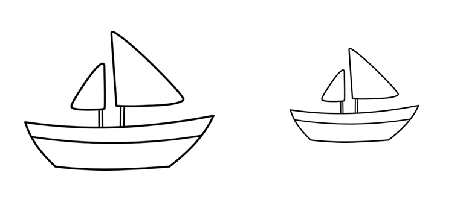


##### Another Example

CNN is good at detecting features but less effective at exploring the spatial relationships among features (perspective, size, orientation). For example, the following picture may fool a simple CNN model in believing that this a good sketch of a human face.


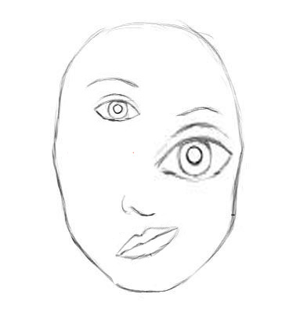


A simple CNN model can extract the features for nose, eyes and mouth correctly but will wrongly activate the neuron for the face detection. Without realize the mis-match in spatial orientation and size, the activation for the face detection will be too high.

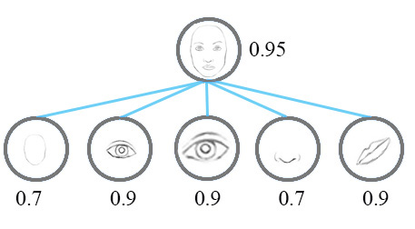


Now, we imagine that each neuron contains the likelihood as well as properties of the features. For example, it outputs a vector containing** [likelihood, orientation, size]**. With this **spatial information**, we can detect the in-consistence in the orientation and size among the nose, eyes and ear features and therefore output a much lower activation for the face detection.

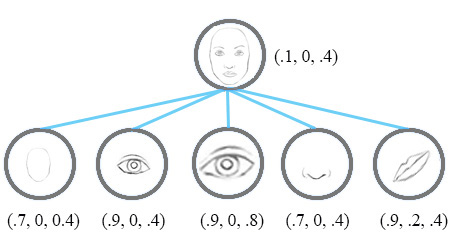


Instead of using the term **neurons**, the technical paper uses the term **capsules** to indicate that capsules **output a vector** instead of a **single scaler value**.

#### Viewpoint Invariant

Let’s examine how a CNN can handle viewpoint variants. For example, how to train a face detection neuron for different orientations.

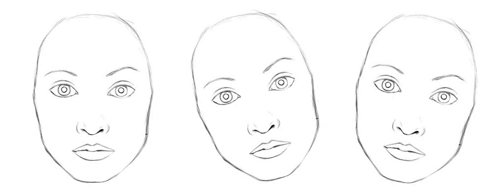

 
Conceptually, we can say the CNN trains neurons to handle different orientations with a final top level face detection neuron.


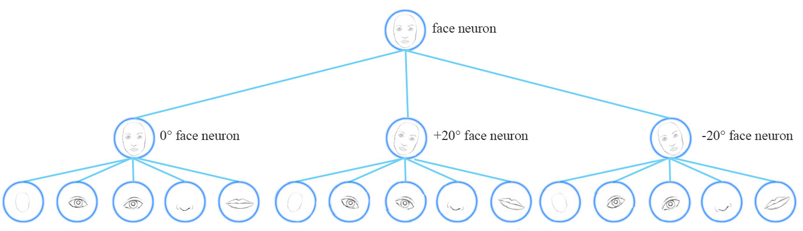


As noted above, for a CNN to handle viewpoint or style variants, we add more convolution layers and features maps. Nevertheless this approach tends to memorize the dataset rather than generalize a solution. It requires a large volume of training data to cover different variants and to avoid overfitting. MNist dataset contains 55,000 training data. i.e. 5,500 samples per digits. However, it is unlikely that children need to read this large amount of samples to learn digits. Our existing deep learning models including CNN seem inefficient in utilizing datapoints. Here is an ironic quote from Geoffrey Hinton:

```
It (convolutional network) works depressingly well.
```

#### Equivariance vs Invariance

Instead of capture a feature with a specific variant, a capsule is trained to capture the likeliness of a feature and its variant. So the purpose of the capsule is not only to detect a feature but also to train the model to learn the variant.

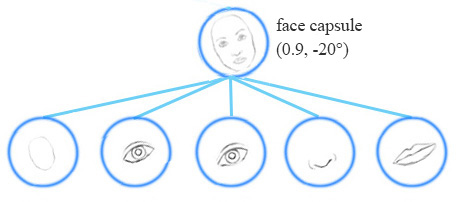


Such that the same capsule can detect the same object class with different orientations (for example, rotate clockwise):


**Invariance** is the detection of features regardless of the variants. For example, a nose-detection neuron detects a nose regardless of the orientation. However, the loss of **spatial orientation in a neuron will eventually hurt the effectiveness** of such invariance model.

**Equivariance** is the detection of objects that can transform to each other (for example, detecting faces with different orientations). Intuitively, the capsule network detects the face is rotated right 20° (equivariance) rather than realizes the face matched a variant that is rotated 20°. By forcing the model to learn the feature variant in a capsule, we may extrapolate possible variants more effectively with less training data. In additional, we may reject adversaries more effectively.

```
With feature property as part of the information extracted by capsules, we may generalize the model better without an over extensive amount of labeled data.
```


```python

```

# Capsule
- A capsule is a group of neurons that not only capture the likelihood but also the parameters of the specific feature.
- Capsule is a nested set of neural layers. So in a regular neural network you keep on adding more layers. In CapsNet you would add more layers inside a single layer. Or in other words nest a neural layer inside another. 
-  In this paper the authors project that human brain have modules called “capsules”. These capsules are particularly good at handling different types of visual stimulus and encoding things like pose (position, size, orientation), deformation, velocity, albedo, hue, texture etc. The brain must have a mechanism for “routing” low level visual information to what it believes is the best capsule for handling it.


#### What capsules represent?
- Each capsules represents the presence and instantiation parameters of a multi-dimesnional entity of the type that the capsule detects.

#### What is the input to the capsules?
- Receives multi-dimensional prediction vectors from capules in the layer below and looks for a tight cluster of predictions.
(Thus it filters noise because high-dimensional coincidences do not happen by chance)


#### What is the output of Capsules?
- The probability than an object of that type is present
- The generalized pose of the object which includes position, orientation, scale, deformation, velocity,color etc., (or) 
- A high probability that an entity of its type exists in its domain
- The center of gravity of the cluster, which is the generalized pose of that entity.


# What the Paper talks about?

### Intro

A capsule is a group of neurons that not only capture the likelihood but also the parameters of the specific feature.

For example, the first row below indicates the probabilities of detecting the number “7” by a neuron. 
A 2-D capsule is formed by combining 2 neurons. This capsule outputs a 2-D vector in detecting the number “7”. 
For the first image in the second row, it outputs a vector $v=(0,0.9)$ The magnitude of the vector $\sqrt{0^2 + 0.9^2}=0.9$ corresponds to the probability of detecting “7”. The second image of each row looks more like a “1” than a “7”. Therefore its corresponding likelihood as “7” is smaller (smaller scaler value or smaller vector’s magnitude but with the same orientation) .

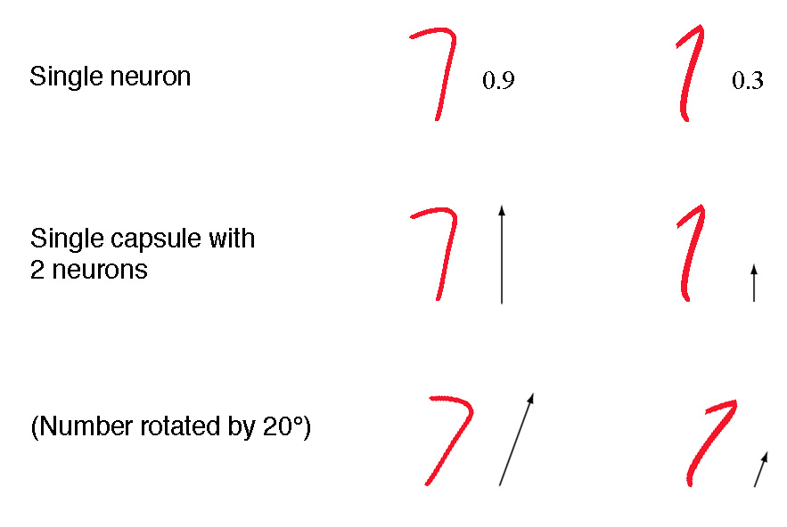


n the third row, we rotate the image by 20°. The capsule will generate vectors with the same magnitude but different orientations. Here, the angle of the vector represents the angle of rotation for the number “7”. As we can image, we can add 2 more neurons to a capsule to capture the size and stroke width.

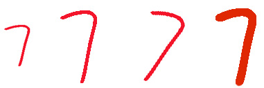


```We call the output vector of a capsule as the activity vector with magnitude represents the probability of detecting a feature and its orientation represents its parameters (properties).
```

### Exponential inefficiencies

For thirty years, the state-of-the-art in speech recognition used hidden Markov models with Gaussian mixtures, together with a one-of-n representation encoding.

```
Page/Section: 8/8:

The one-of-n representations that they use are exponentially inefficient compared with, say, a recurrent neural network that uses distributed representations.
```

**Why exponentially ineffecient?** To double the amount of information that an HMM (hidden Markov model) can remember we need to square the number of hidden nodes. For a recurrent net we only need to double the number of hidden neurons.

```
Page/Section: 8/8:

Now that convolutional neural networks have become the dominant approach to object recognition, it makes sense to ask whether there are any exponential inefficiencies that may lead to their demise. A good candidate is the difficulty that convolutional nets have in generalizing to novel viewpoints.
```

CNNs can deal with translation out of the box, but for robust recognition in the face of all other kinds of transformation we have two choices:

- Replicate feature detectors on a grid that grows exponentially with the number of dimensions, or
- Increase the size of the labelled training set in a similarly exponential way.

The big idea behind capsules (a new kind of building block for neural networks) is to efficiently encode viewpoint invariant knowledge in a way that generalises to novel viewpoints. To do this, capsules contain explicit transformation matrices.


A network layer is divided into many small groups of neurons called “capsules.” Capsules are designed to support transformation-independent object recognition.

```
Page/Section : 1/1

The activities of the neurons within an active capsule represent the various properties of a particular entity that is present in the image. These properties can include many different types of instantiation parameter such as pose (position, size, orientation), deformation, velocity, albedo, hue, texture, etc.. One very special property is the existence of the instantiated entity in the image.
```

The authors describe the role of the capsules as like **‘an inverted rendering process’** in a [graphics pipeline](https://en.m.wikipedia.org/wiki/Graphics_pipeline). 

Abstract 3D Teapot model ---> Coordinate system of a 3D world --->  translated to a 3D camera coordinate system with the camera at the origin ---> Lighting and reflections are handled followed by a projection transformation into the 2D view of the camera

Capsules start with that 2D view as input and try to reverse the transformations to uncover the abstract model class (teapot) behind the image.

```
Page/Section : 2/2

There are many possible ways to implement the general idea of capsules… In this paper we explore an interesting alternative which is to use the overall length of the vector of instantiation parameters to represent the existence of the entity and to force the orientation of the vector to represent the properties of the entity.
```

```
Page/Section : 2/2
For all but the first layer of capsules, the total input to a capsule s_j is a weighted sum over all “prediction vectors” u_j|i from the capsules in the layer below and is produced by multiplying the output u_i of a capsule in the layer below by a weight matrix W_ij
```

$$s_j = \sum i c_{ij}  \hat{u}_{j|i}$$

$$\hat{u}_{j|i} = W_{ij}u_i$$

### Compute the output of a capsule

Recall a fully connected neural network:

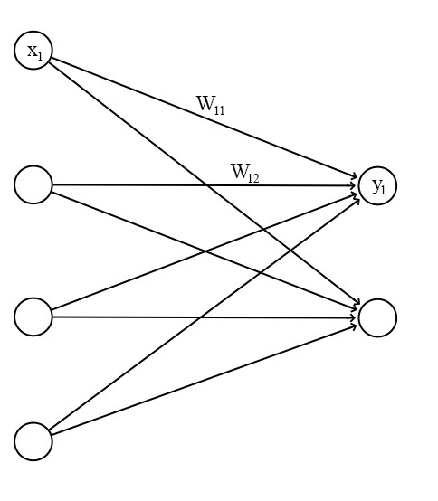


The output of each neuron is computed from the output of the neurons from the previous layer:

$$
% <![CDATA[
\begin{split}
z_j &= \sum_i W_{ij} x_i \\
y_j &= ReLU(z_j) \\
\end{split} %]]>
$$

where $W_{ij}, z_j$ and $y_i$ are all scalaras

For a capsule, the input $u_i$ and the output $v_j$ of a capsule are vectors.

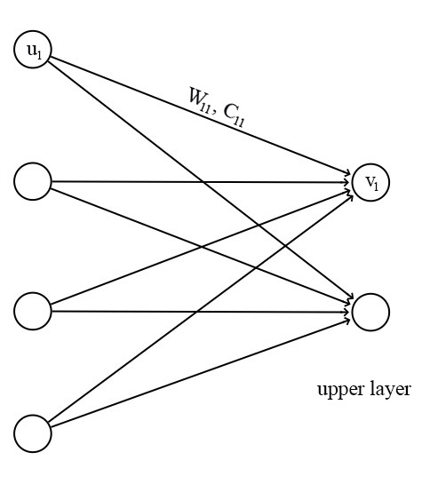


We apply a transformation matrix $W_{ij}$ to the capsule output $u_i$ of the pervious layer. For example, with a $m×k$ matrix, we transform a k-D $u_i$ to a m-D $u^{j|i}$. $((m×k) × (k×1)⟹m×1)$ Then we compute a weighted sum $s_j$ with weights $c_{ij}$.

$$
% <![CDATA[
\begin{split}
\hat{u}_{j|i} &= W_{ij} u_i \\
s_j & = \sum_i c_{ij}  \hat{u}_{j|i} \\
\end{split} %]]>
$$

$c_{ij}$  are coupling coefficients that are trained by the iterative dynamic routing process (discussed next) and $\sum_j c_{ij}$ are designed to sum to one.

Instead of applying a ReLU function, we apply a squashing function to scale the vector between 0 and unit length.

$$
% <![CDATA[
\begin{split}
v_{j} & = \frac{\| s_{j} \|^2}{ 1 + \| s_{j} \|^2} \frac{s_{j}}{ \| s_{j} \|}  \\
\end{split} %]]>
$$

It shrinks small vectors to zero and long vectors to unit vectors. Therefore the likelihood of each capsule is bounded between zero and one.

$$
% <![CDATA[
\begin{split}
v_{j} & \approx \| s_{j} \| s_{j}  \quad & \text{for } s_{j} \text { is short } \\
v_{j} & \approx \frac{s_{j}}{ \| s_{j} \|}  \quad & \text{for } s_{j} \text { is long } \\
\end{split} %]]>
$$

### Connecting capsules in layers

A Capsule Network, or CapsNet combines multiple capsule layers. For example, here’s a sample network for the MNIST handwritten digit recognition task:


In general, the idea is to form a ‘parse tree’ of the scene. Layers are divided into capsules and capsules recognise parts of the scene. Active capsules in a layer from part of the parse tree, and each active capsule chooses a capsule in the layer above to be its parent in the tree.

```
Page/Section: 2/1
The fact that the output of a capsule is a vector makes it possible to use a powerful dynamic routing mechanism to ensure that the output of the capsule gets sent to an appropriate parent in the layer above.
```

- Initially the output is routed to all possible parents, but scaled down by coupling coefficients that sum to 1 (determined by a ‘routing softmax’).
- For each possible parent, the capsule computes a ‘prediction vector’ by multiplying its own output by a weight matrix.
- If the prediction vector has a large scalar product with the output of a possible parent, there is top-down feedback which has the effect of increasing the coupling coefficient for that parent, and decreasing it for other parents.


To replicate knowledge across space, all but the last layer of capsules are convolutional.

In the final layer of the network (DigitCaps in the figure above) we want the top-level capsule for digit class k to have a long instantiation vector if and only if that digit is present in the image. To allow for multiple digits, a separate margin loss is used for each digit capsule. An additional reconstruction loss is used to encourage the digit capsules to encode the instantiate parameters of the digit: **“during training, we mask out all but the activity vector of the correct digit capsule, then we use this activity vector to reconstruct.”**

### Squashing Function

$$
% <![CDATA[
\begin{split}
v_{j} & = \frac{\| s_{j} \|^2}{ 1 + \| s_{j} \|^2} \frac{s_{j}}{ \| s_{j} \|}  \\
\end{split} %]]>
$$


- This routing by agreement method is superior than the current mechanism like max-pooling.

- **Max pooling** **routes** based on the **strongest feature detected** in the lower layer. 
- Apart from dynamic routing, CapsNet talks about adding squashing to a capsule. Squashing is a non-linearity. So instead of adding squashing to each layer like how you do in CNN, you add the squashing to a nested set of layers. So the squashing function gets applied to the vector output of each capsule.

- ReLU or similar non linearity functions work well with single neurons. But the paper found that this squashing function works best with capsules. This tries to squash the length of output vector of a capsule. It squashes to 0 if it is a small vector and tries to limit the output vector to 1 if the vector is long. The dynamic routing adds some extra computation cost. But it definitely gives added advantage.

### Iterative dynamic Routing

In deep learning, we use backpropagation to train model parameters. The transformation matrix $W_{ij}$ in capsules are still trained with backpropagation. Nevertheless, the coupling coefficients $c_{ij}$ are calculated with a new iterative dynamic routing method.

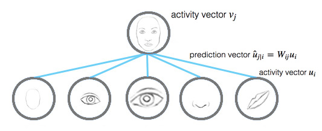


The prediction vector u^j|iu^j|i is computed as (with the transformation matrix):

$$
% <![CDATA[
\begin{split}
\hat{u}_{j|i} &= W_{ij} u_i \\
\end{split} %]]>
$$

which uiui is the activity vector for the capsule $i$ in the layer below.

The activity vector $v_j$ for the capsule $j$ in the layer above is computed as:

$$
% <![CDATA[
\begin{split}
s_j & = \sum_i c_{ij}  \hat{u}_{j|i} \\
v_{j} & = \frac{\| s_{j} \|^2}{ 1 + \| s_{j} \|^2} \frac{s_{j}}{ \| s_{j} \|}  \\
\end{split} %]]>
$$

Intuitively, prediction vector $u^{j|i}$ is the prediction (vote) from the capsule $i$ on the output of the capsule $j$ above. If the activity vector has close similarity with the prediction vector, we conclude that capsule $i$ is highly related with the capsule $j$. (For example, the eye capsule is highly related to the face capsule.) Such similarity is measured using the scalar product of the prediction and activity vector. Therefore, the similarity takes into account on both likeliness and the feature properties. (instead of just likeliness in neurons) We compute a relevancy score $b_ij$ according to the similarity:

$$
\begin{split}
b_{ij} ← \hat{u}_{j \vert i} \cdot v_j \\
\end{split}
$$

The coupling coefficients $c_{ij}$ is computed as the softmax of $b_{ij}$:

$$
% <![CDATA[
\begin{split}
c_{ij} & = \frac{\exp{b_{ij}}} {\sum_k \exp{b_{ik}} } \\
\end{split} %]]>
$$

To make $b_{ij}$ more accurate , it is updated iteratively in multiple iterations (typically in 3 iterations).

$$
\begin{split}
b_{ij} ← b_{ij} + \hat{u}_{j \vert i} \cdot v_j \\
\end{split}
$$

Here is the final pseudo code for the dynamic routing:


```
Routing a capsule to the capsule in the layer above based on relevancy is called Routing-by-agreement.
```


### Max pooling shortcoming

The max pooling in a CNN handles translational variance. Even a feature is slightly moved, if it is still within the pooling window, it can still be detected. Nevertheless, this approach keeps only the max feature (the most dominating) and throws away the others. Capsules maintain a weighted sum of features from the previous layer. Hence, it is more suitable in detecting overlapping features. For example detecting multiple overlapping digits in the handwriting:

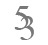


### Significant of routing-by-agreement with capsules

In deep learning, we use backpropagation to train the model’s parameters based on a cost function. Those parameters (weights) control how signal is routed from one layer to another. If the weight between 2 neurons is zero, the activation of a neuron is not propagated to that neuron.

Iterative dynamic routing provides an alternative of how signal is routed based on feature parameters rather than one size fit all cost function. By utilizing the feature parameters, we can theoretically group capsules better to form a high level structure. For example, the capsule layers may eventually behaves as a parse tree that explore the part-whole relationship. (for example, a face is composed of eyes, a nose and a mouth) The iterative dynamic routing controls how much a signal is propagate upward to the capsules above utilizing the transformation matrix, the likeliness and the feature’s properties.

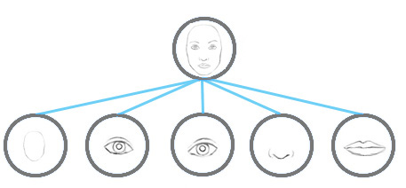


The iterative dynamic routing with capsules is just one showcase in demonstrating the routing-by-agreement. We expect more capsule models with advance routing methods will be introduced in coming years. In a second paper on capsules Matrix capsules with EM routing, a [likeliness, 4x4 pose matrix] matrix capsule is proposed (rather than a k-D vector capsule) with a new Expectation-maximization routing (EM routing). The pose matrices are designed to capture the viewpoint of the object. For example, the second row of the picture below represent the same object above with a different pose matrix (viewpoint).


(Source from the paper Matrix capsules with EM routing)


The objective of the EM routing is to group capsules to form a part-whole relationship with a clustering technique (EM). In machine learning, we use EM to cluster datapoints into different Gaussian distributions. For example, we cluster the datapoints below into two clusters modeled by two gaussian distributions.

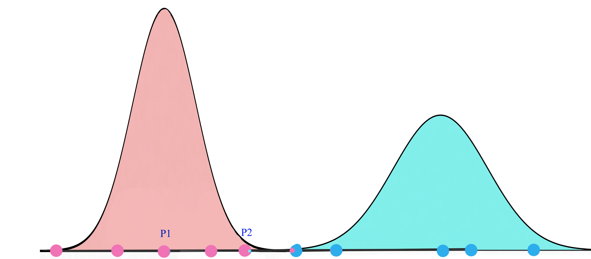


For the mouth, eyes and nose capsules in the lower layer, each of them makes predictions (votes) on the pose matrices of its possible parent capsule(s) through a transformation matrix. The role of the EM routing is to cluster lower level capsules that produce similar votes. Conceptually the votes from the mouth, eyes and nose capsules may cluster into the pink region above that can be represented by their parent capsule (face).

```
A higher level feature (a face) is detected by looking for agreement between votes from the capsules one layer below. We use EM routing to cluster capsules that have close proximity of the corresponding votes.
```

The transformation matrix to compute the vote is **viewpoint invariant**. We **do not need different transformation matrices** for **different viewpoints** Even the viewpoint may change, the pose matrices (or votes) corresponding to the same high level structure (a face) will change in a co-ordinate way such that a cluster with the same capsules can be detected.


Hence, the EM routing groups related capsules regardless of the viewpoint. Unlike CNN which each neuron may detect a different viewpoint, the transformation matrix is viewpoint independent which may require less data to train.

New capsules and routing algorithm will hopefully build higher level structures much easier and much effectively with less training data.


### CapsNet architecture

Finally, we apply capsules to build the CapsNet to classify the MNist digits. The following is the architecture using CapsNet.

<div class="imgcap">

</div>

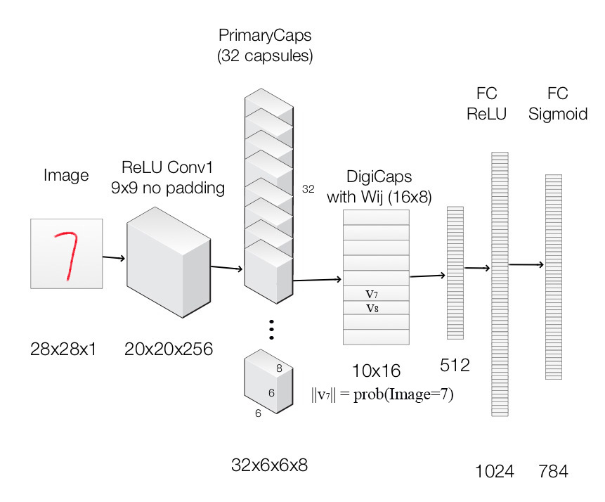


Image is feed into the ReLU Conv1 which is a standard convolution layer. It applies 256 9x9 kernels to generate an output with 256 channels (feature maps). With stride 1 and no padding, the spatial dimension is reduced to 20x20. ( 28-9+1=20) 

It is then feed into PrimaryCapsules which is a modified convolution layer supporting capsules. It generates a 8-D vector instead of a scalar. PrimaryCapsules used 8x32 kernels to generate 32 8-D capsules. (i.e. 8 output neurons are grouped together to form a capsule) PrimaryCapsules uses 9x9 kernels with stride 2 and no padding to reduce the spatial dimension from 20x20 to 6x6 ( $ \lfloor \frac{20-9}{2} \rfloor + 1 = 6 $). In PrimaryCapsules, we have 32x6x6 capsules. 

It is then feed into DigiCaps which apply a transformation matrix $W_{ij} $ with shape 16x8 to convert the 8-D capsule to a 16-D capsule for each class $j$ (from 1 to 10).

$$
\begin{split}
\hat{u}_{j|i} &= W_{ij} u_i \\
\end{split}
$$

The final output $v_j$ for class $j$ is computed as:

$$
\begin{split}
s_j & = \sum_i c_{ij}  \hat{u}_{j|i} \\
v_{j} & = \frac{\| s_{j} \|^2}{ 1 + \| s_{j} \|^2} \frac{s_{j}}{ \| s_{j} \|}  \\
\end{split}
$$

Because there are 10 classes, the shape of DigiCaps is 10x16 (10 16-D vector.) Each vector $v_j$ acts as the capsule for class $j$. The probability of the image to be classify as $j$ is computed by $\| v_j \|$. In our example, the true label is 7 and $v_7$ is the latent representation of our input. With a 2 hidden fully connected layers, we can reconstruct the 28x28 image from $v_7$.

Here is the summary of each layers:

| Layer Name | Apply | Output shape |
| --- | --- | --- | --- |
| Image | Raw image array |  28x28x1|
| ReLU Conv1 | Convolution layer with 9x9 kernels output 256 channels, stride 1, no padding with ReLU  | 20x20x256 |
| PrimaryCapsules | Convolution capsule layer with 9x9 kernel output 32x6x6 8-D capsule, stride 2, no padding  | 6x6x32x8 |
| DigiCaps | Capsule output computed from a $W_{ij} $ (16x8 matrix) between $u_i$ and $v_j$ ($i$ from 1 to 32x6x6 and $j$ from 1 to 10). | 10x16 |
| FC1 | Fully connected with ReLU | 512 |
| FC2 | Fully connected with ReLU | 1024 |
| Output image | Fully connected with sigmoid | 784 (28x28) | 

> Our capsule layers use convolution kernels to explore locality information.


### Representations in MNIST
The CapsNet above is trained on MNIST, and then the capsules are probed by feeding perturbed versions of the activity vector into the decoder network to see how the perturbation affects the reconstruction.

```
Page/Section: 5/5.1
Since we are passing the encoding of only one digit and zeroing out other digits, the dimensions of a digit capsule should learn to span the space of variations in the way digits of that class are instantiated. These variations include stroke thickness, skew and width. They also include digit-specific variations such as the length of the tail of a 2.
```

Here are some examples of the learned dimensions:

<div class="imgcap">

</div>


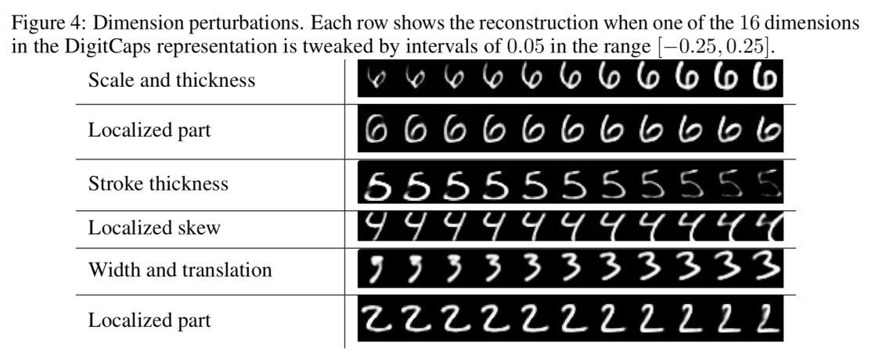


With a 3-layer network, CapsNet overall achieves a 0.25% test error – an accuracy previously only achieved by deeper networks.

To test the robustness of CapsNet to affine transformation, a CapsNet and traditional CNN were both trained on a padded and translated MNIST training set. The network was then tested on the affNIST data set, in which each example is an MNIST digit with a random small affine transformation. CapsNet and the traditional network achieved similar accuracy (99.23% vs 99.22%) on the expanded MNIST test set. CapsNet scored 79% on the affNIST test set though, handily beating the CNN’s score of 66%.


### Segmentation

```
Page/Section: 6/6
Dynamic routing can be viewed as a parallel attention mechanism that allows each capsule at one level to attend to some active capsules at the level below and to ignore others. This should allow the model to recognise multiple objects in the image even if objects overlap.
```

And indeed it does! A generated MultiMNIST training and test dataset is created by overlaying one digit on top of another with a shift of up to 4 pixels on each axis. CapsNet is correctly able to segment the image into the two original digits. The segmentation happens at a higher level than individual pixels, and so it can deal correctly with cases where a pixel is in both digits, while still accounting for all pixels.

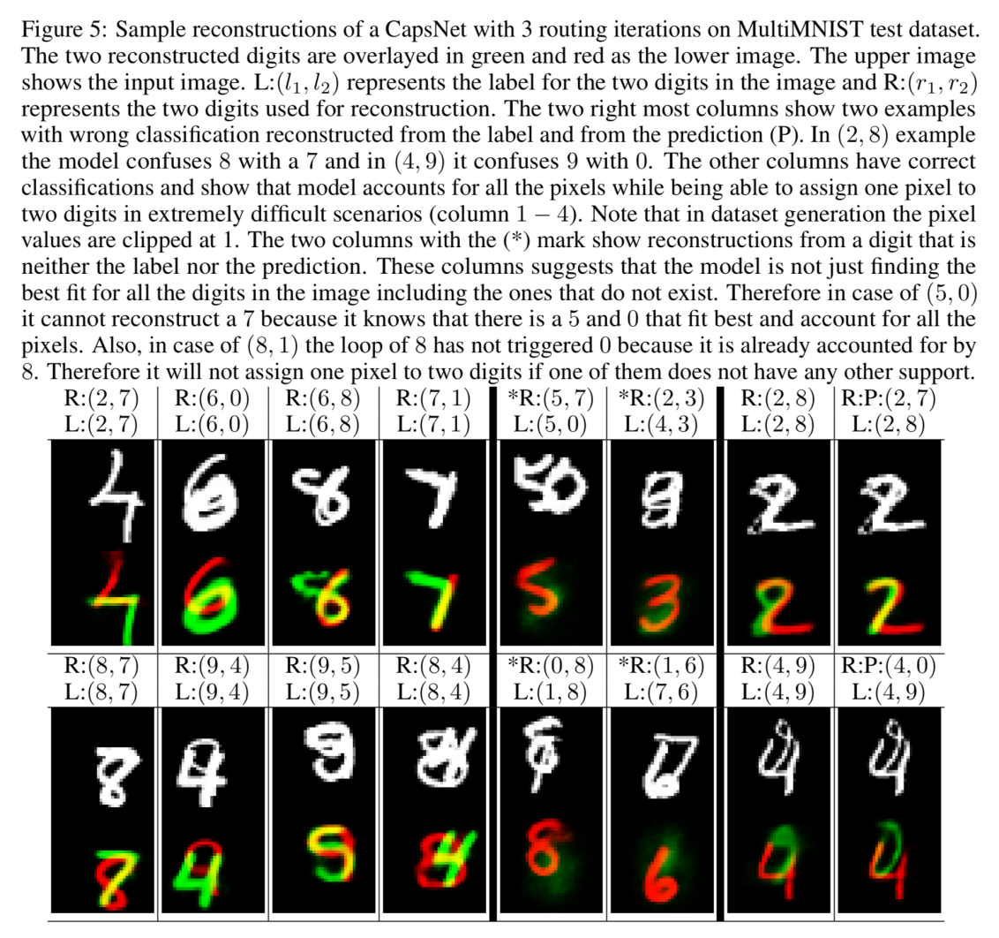


```python
# Convert this notebook for Docs
! jupyter nbconvert --to markdown --output-dir ../../docs/_posts 2017-12-18-CapsulesCookBook.ipynb
```

    [NbConvertApp] Converting notebook 2017-12-18-CapsulesCookBook.ipynb to markdown
    [NbConvertApp] Writing 35185 bytes to ../../docs/_posts/2017-12-18-CapsulesCookBook.md


```python

```


```python

```


```python

```
